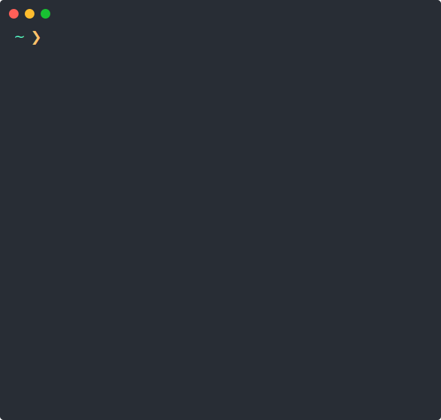

# Rcat
### A better netcat for hackers

### Overview

__Rcat__ is a modern _netcat_ written in Rust, packed with features for hackers.

Here we listen on the port `tcp:9001`, and recieve an HTTP request made with `curl`.

### Features

* A syntax similar to netcat:
    - `-l` to listen.
    - `-u` for udp.
* Auto __upgrade__ of __Reverse shell__ with `--pwn`.
* Support of __TLS__ with `-t` or `--tls`.

In this demo gif, we do an HTTPS request by hand.
We use `-t` to establish a _TLS connection_, and `-c` to send _CRLF_ newlines.